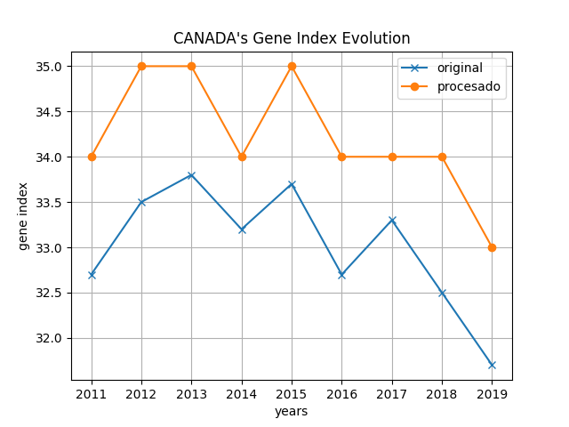

# TP1

## Implemetación

Se trata de un desarrollo por capas, en primera instancia se levanta un programa en **python** que utilizando la biblioteca *requests* hace una peticion del tipo **GET** a una [API publica](https://api.worldbank.org/v2/en/country/all/indicator/SI.POV.GINI?format=json&date=2011:2020&per_page=32500&page=1&country=%22Argentina%22). La respuesta se procesa y se convierte en un objeto json el cual se filtra para obtener los datos del indice gene del pais de interes (Argentina). Esta lista filtrada se pasa posteriormente convierte a un arreglo de C utilizando la libreria de *ctypes* que permite realizar la conversion de tipos de datos de python a tipos de dato aceptables para C. Con esto se puede proceder a utilizar las funciones de la libreria desarrollada en C. Esta libreria carga los valores en un arreglo el cual despues es graficado en python usando la libreria *matplotlib*. El grafico resultante se guarda en una imagen en el directorio results.

### Diagrama de Bloques


### Diagrama de Secuencia


## Instrucciones de Uso

### Compilación codigo C para crear libreria compartida
- Crear objeto del codigo de assembler: (compilar para 32 bits)
```sh
nasm -f elf32 sum_array.asm
```
- Compilar driver de C y crear libreria compartida (compilacion de 32 bits):
```sh
gcc -shared -W -o libgini_calc.so sum_array.o -m32 gini_calc.c
```

O para probar la funcion en C con assembler:
```sh
nasm -f elf32 sum_array.asm 
gcc -o prueba sum_array.o -m32 gini_calc.c 
./prueba
```

### Instalar Librerias de Python
Para correr python con un programa en C compilado para 32 bits, es necesario utilizar una entorno de python tambien de 32 bits.

- Instalar [miniconda](https://docs.anaconda.com/free/miniconda/)
- Instalar entorno de py32:
```sh
conda create -n py32 python=3.7 -c https://repo.anaconda.com/pkgs/main/linux-32/ --override-channels
```
- Activar entorno de py32:
```sh
conda activate py32
```
- Actualizar pip:
```sh
pip install --upgrade pip
```
- Instalar librerias:
```sh
pip install numpy requests matplotlib
```

### Ejecutar programa de Python
```sh
python server.py
```

## Resultados





