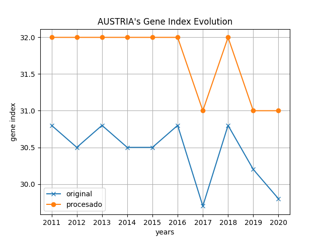

# TP1

## Implemetación

Se trata de un desarrollo por capas, en primera instancia se levanta un programa en **python** que utilizando la biblioteca *requests* hace una peticion del tipo **GET** a una [API publica](https://api.worldbank.org/v2/en/country/all/indicator/SI.POV.GINI?format=json&date=2011:2020&per_page=32500&page=1&country=%22Argentina%22). La respuesta se procesa y se convierte en un objeto json el cual se filtra para obtener los datos del indice gene del pais de interes (Argentina). Esta lista filtrada se pasa posteriormente convierte a un arreglo de C utilizando la libreria de *ctypes* que permite realizar la conversion de tipos de datos de python a tipos de dato aceptables para C. Con esto se puede proceder a utilizar las funciones de la libreria desarrollada en C. Esta libreria carga los valores en un arreglo el cual despues es graficado en python usando la libreria *matplotlib*. El grafico resultante se guarda en una imagen en el directorio results.

### Diagrama de Bloques

### Diagrama de Secuencia

## Instrucciones de Uso

### Compilación codigo C para crear biblioteca compartida

- gcc -shared -W -o libgini_calc.so gini_calc.c

## Instalar librerias necesarias para generar los graficos

- pip3 install matplotlib

### Ejecutar codigo en Python con librerias en C
- python server.py
- python3 server.py

## Resultados primera parte

