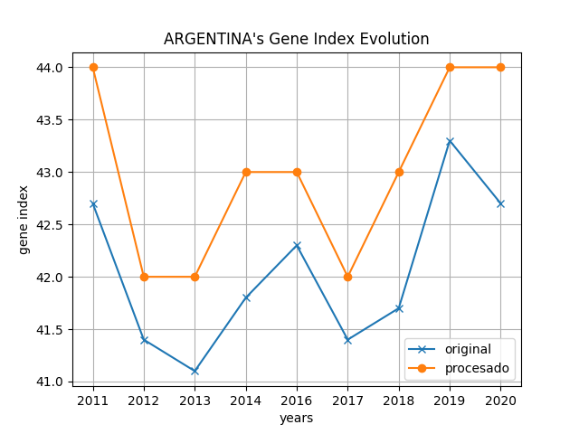
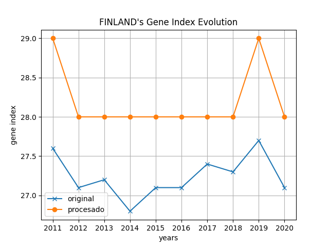

# TP1

## Implemetación

Se trata de un desarrollo por capas, en primera instancia se levanta un programa en **python** que utilizando la biblioteca *requests* hace una peticion del tipo **GET** a una [API publica](https://api.worldbank.org/v2/en/country/all/indicator/SI.POV.GINI?format=json&date=2011:2020&per_page=32500&page=1&country=%22Argentina%22). La respuesta se procesa y se convierte en un objeto json el cual se filtra para obtener los datos del indice gene del pais de interes (Argentina). Esta lista filtrada se pasa posteriormente convierte a un arreglo de C utilizando la libreria de *ctypes* que permite realizar la conversion de tipos de datos de python a tipos de dato aceptables para C. Con esto se puede proceder a utilizar las funciones de la libreria desarrollada en C que a su vez se compila con codigo desarrollado en assembler usando convenciones de llamadas. Esta libreria carga los valores en un arreglo el cual despues es graficado en python usando la libreria *matplotlib*. 

Todo esto se complementa con una capa superior de interaz de usuario que permite usar el programa de una manera intuitiva y amigable.

### Diagrama de Bloques

```mermaid
flowchart TD
    A[Start Server] --> B(Get Data)
    B --> C(Filter Data)
    C --> D(Get Values and Dates)
    D --> E(Process Values)
    E --> F(Plot Result)
    F --> B
```


### Diagrama de Secuencia


## Instrucciones de Uso

### Compilación codigo C para crear libreria compartida
- Crear objeto del codigo de assembler: (compilar para 32 bits)
```sh
nasm -f elf32 sum_array.asm
```
- Compilar driver de C y crear libreria compartida (compilacion de 32 bits):
```sh
gcc -shared -W -o libgini_calc.so sum_array.o -m32 gini_calc.c
```

O para probar la funcion en C con assembler:
```sh
nasm -f elf32 sum_array.asm 
gcc -o prueba sum_array.o -m32 gini_calc.c 
./prueba
```

### Instalar Librerias de Python
Para correr python con un programa en C compilado para 32 bits, es necesario utilizar una entorno de python tambien de 32 bits.

- Instalar [miniconda](https://docs.anaconda.com/free/miniconda/)
```sh
mkdir -p ~/miniconda3
wget https://repo.anaconda.com/miniconda/Miniconda3-latest-Linux-x86_64.sh -O ~/miniconda3/miniconda.sh
bash ~/miniconda3/miniconda.sh -b -u -p ~/miniconda3
rm -rf ~/miniconda3/miniconda.sh--override-channels
```
- Después de la instalación, inicialice su Miniconda. Los siguientes comandos se inicializan para los shells bash y zsh:
```sh
~/miniconda3/bin/conda init bash
~/miniconda3/bin/conda init zsh
```
- Instalar entorno de py32:
```sh
conda create -n py32 python=3.7 -c https://repo.anaconda.com/pkgs/main/linux-32/ --override-channels
```
- Activar entorno de py32:
```sh
conda activate py32
```
- Instalar libc11-6 (32 bits):
```sh
sudo apt-get install libx11-6:i386
```
- Actualizar pip:
```sh
pip install --upgrade pip
```
- Instalar librerias necesarias para el programa:
```sh
pip install numpy requests matplotlib
```
- Libreria para correr tests de python:
```sh
pip install pytest
```

### Ejecutar programa de Python

```sh
python server.py
```

## Resultados






## Tests

### Prueba End to End

Se ve el funcionamiento del programa desde el punto de vista del usuario, en la cual 
usamos una interfaz visual creada desde python.


FALTA IMAGEN FINAL


### Prueba test función Assembler

Se llama a la funcion de assembler desde C pasando un arreglo de numeros para ver como
se comporta la funcion y que valores que retorna sean los correctos.


Resultados de la ejecución:


### Tests Unitarios con pytest

Para correr los tests unitarios de python correr pytest en el directorio raiz:
```sh
pytest
```


### GDB

- Compilar el programa con la opción de depuración (con la flag -g):
```sh
gcc -g -o prueba sum_array.o -m32 gini_calc.c 
```
- Correr gdb:
```sh
gdb prueba
```
- Se debe colocar un break point en el punto donde se quiere arrancar el debug:
```sh
break _sum_array
```
En este caso se realiza el debug desde que se llama a la funcion en assembler.

- Se debe ir paso por paso con la instrucción nexti se vera lo siguiente:


En donde podemos observar que se ingresa al bucle creado en el programa de assembler.

- luego una vez aqui se puede ver el stack de llamadas que es el siguiente:


- Tambien si se utiliza el comando info locals podemos ver como se hace la asignación nuestro puntero en cuanto finaliza la funcion de assembler:


